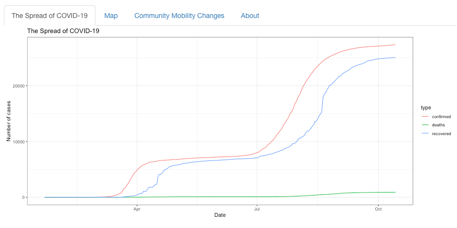
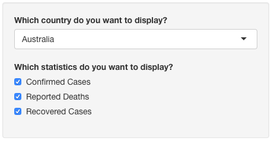
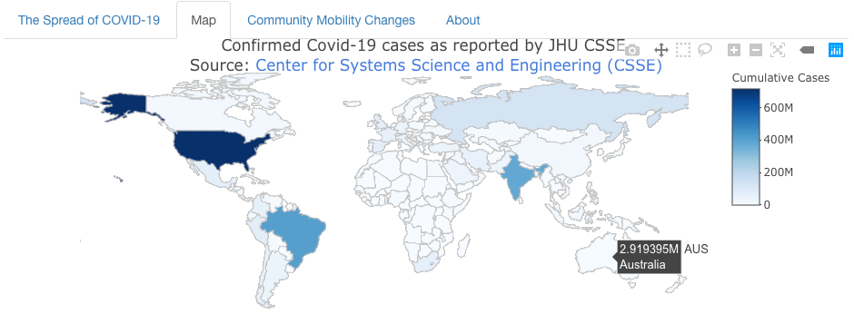
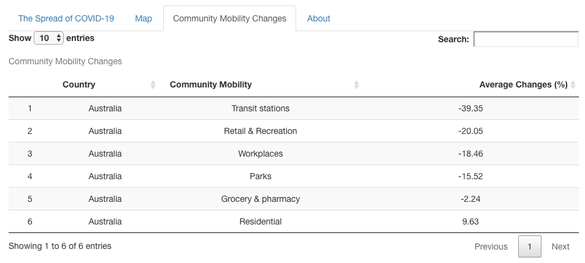

```{r setup, include=FALSE}
knitr::opts_chunk$set(echo = FALSE, message = FALSE, warning = FALSE, fig.pos = 'H', fig.align = 'center')
```

```{r package}
library(tidyverse)
```

# Introduction

The Shiny App tracks COVID-19 data worldwide, including confirmed cases, reported deaths, recovered cases and community mobility changes.

## The Spread of COVID-19

The **The Spread of COVID-19** collects coronavirus cases from all countries in the world, including confirmed cases, reported deaths and recovered cases.The raw data pulled from the Johns Hopkins University Center for Systems Science and Engineering (JHU CCSE) Coronavirus [repository](https://github.com/CSSEGISandData/COVID-19).


You can filter the countries you want to observe through the selection bar on the left, as well as the statistics.



## Map

The **Map** section provides a world map. By moving the mouse to the country, it will show you the country name and the cumulative number of confirmed cases so far. Due to the large amount of data, this may take a while.



## Community Mobility Changes

**Community Mobility Changes** shows movement trends across different categories of places, and you can also filter countries through the options on the left. Community Mobility Changes data comes from [Google](https://www.google.com/covid19/mobility/) (some countries may have missing data).



# Self Review

## What did I do well?

### Good Layout
I used `tabsetPanel()` to subdivide the user-interface into discrete sections. So the different output panels will share the same input sidebar.

### Daily Updating Data
The package I used updates COVID-19 data daily.


## What are the points I can improve on?

### Optimize Speed of App

Because of the big amount of data, it takes a long time to show the Map section. I am trying to learning how to optimize the speed when loading such big data.

### Output Size

It is better if all sections are the same size.


## What are some things that I’d like to add that’s plausible?

### More values in Map

I would like to add cumulative reported deaths and recovered cases on the world map.


## What are some things that I’d like to add that cannot be done yet due to limitation in data or technology?

The Community Mobility Changes data does not cover all countries.

# Data Resources

* Center for Systems Science and Engineering (CSSE) at Johns Hopkins University: https://github.com/CSSEGISandData/COVID-19

* Google COVID-19 Community Mobility Reports: https://www.google.com/covid19/mobility/